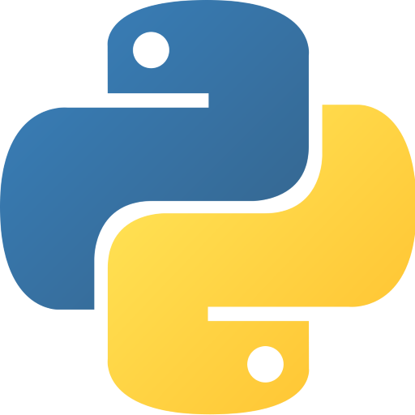

# Curso básica de Python 

En este curso aprenderás a programar en python 

**Requisitos**

- Python 3.10 o superior
- Computadora con Windows, Linux o MacOS
- Editor de texto como [Visual Studio Code](https://code.visualstudio.com/)

